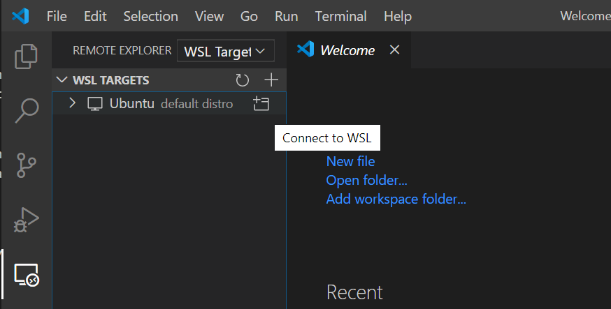
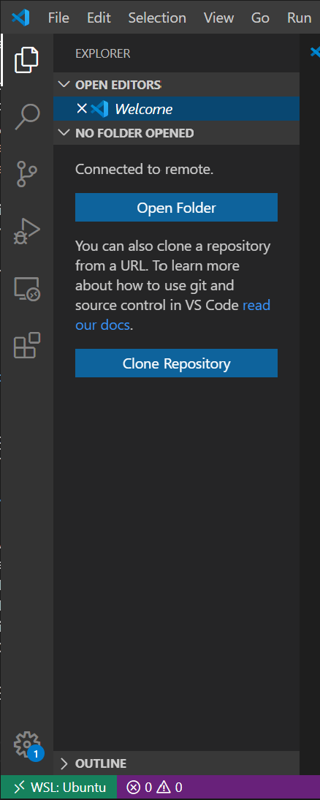

# Setup for Windows

---
**Note**

If you just want a simple working windows environment there is a "no frills" windows install section at the end.

---

## Windows or WSL?

One important decision to make at the start is to decide whether or not to make Windows your development environment. Generally, python works fine on Windows, so it is perfectly viable for python alone. However, there are a number of python packages for astronomy that are not compatible with Windows. For Code/Astro, all of the packages we will work with work with Windows, but this may not be true for other packages you might encounter for your research.

The suggested alternative is to use Windows Subsystem for Linux (WSL), which is a full Linux operating system running inside of Windows. This is supported by default now on Windows 10 and it is fairly simple to setup. The additional complexity introduced by WSL is that there usually is 1-2 more steps that need to be done to hook up your programming setup to use the python installed under WSL for your development. This is generally not a large barrier, but it involves doing a few extra steps. 

For Code/Astro, we will present instructions on how to set things up for WSL and native Windows. Generally, we will recommend you using WSL for the purpose of software programming for astronomy.

## Windows Subsystem for Linux (WSL)

WSL allows you to run a virtual Linux operating system in Windows. This is officially supported by Microsoft and lets you do anything a Linux user would do. 

### Install WSL

See the WSL installation instructions here: https://docs.microsoft.com/en-us/windows/wsl/install-win10. WSL is currently transitioning from WSL 1 to WSL 2, and depending on your Windows version, you may only be able to install WSL 1. This is perfectly ok: try to follow the steps to install WSL 2, but if you do not meet the requirements just install WSL 1 and it will have all the features you need. When you get to the step of choosing a Linux distribution from the Microsoft store, we suggest you install Ubuntu, as it is probably the easiest to work with. If it is installed successfully, you should be open Ubuntu from the Start Menu and have a black terminal screen appear. Anything you do inside this terminal screen will be done through Ubuntu. But as we will see, this is not the only way to run things in Linux.

### Install xming

Normally, WSL is just a command prompt, so it does not have a GUI interface. If you try to display matplotlib plots through the command line, it will not work, because WSL does not directly talk with your Windows desktop normally. However, you can make this communication happen with xming, which can be installed from here: https://sourceforge.net/projects/xming/.

After you download and install xming, click on it to run. It runs passively in the background, so you should not expect anything to happen. You should just see the xming icon appear in the Windows taskbar. This means the connection is active. Then, add the following line to your .bashrc file in WSL so that WSL knows to forward displays to xming. 

    echo export DISPLAY=localhost:0.0 >> ~/.bashrc

### Install git

Git can be installed inside of Linux or in Windows. We recommend both, as it does not take up much space and is very convenient. For this workshop, we will work only with the git in Linux, but here we will describe how to install both. If you are using WSL with Ubuntu, you can install it in Ubuntu using its package manager (the most common way to install applications in Ubuntu):

    > sudo apt-get install git

You will need to type your root password (it likely is the same as your Windows password).

In Windows, to install git, download the executable from the git website: https://git-scm.com/download/win. You generally can just download the regular one labeled "Click here to download manually". We won't use the Windows git, but you may find it useful in the future. 

### Make your Windows files easily accessible

Be default, WSL starts out in its own specific Linux portion of your filesystem. If you run `pwd` and your username is codeastro, then you will see you start out here (this is your home directory):

    > pwd
    /home/codeastro

We recommend you save your files in the Windows part of your filesystem for easy access with other applications. You can find your main Windows drives (e.g., `C:\`) in the `/mnt/` directory. For example, if my Windows account name is codeastro and it is stored on my `C:\` drive, then I can find my user folder at `/mnt/c/Users/codeastro/` when it is normally located at `C:\Users\codeastro\` on regular Windows. If I have a folder called Research in my Documents folder (located at `C:\Users\codeastro\Documents\Research\`), then I can find it at `/mnt/c/Users/codastro/Documents/Research/`. 

Instead of having to do this complex navigation each time, we recommend using a symbolic link to connect your main work folders to your WSL home directory. FOr example, to link my Research folder in the example above, I can do something like this:

    > ln -s /mnt/c/Users/codastro/Documents/Research/ Research

Now you should have a linked folder called Research. If you `cd` into the folder, you should see the regular contents of that folder. 

### Setup Python in Linux

Follow the Linux setup guide to install and configure python for your WSL setup. Download the Linux version of miniconda and install it from WSL.

### Make Git cross compatible. 

Windows and Linux use slightly different line endings. This sometimes causes Linux or Windows to think a file is modified in git when it hasn't been due to different line ending usage. In Linux, run the following line to fix this:

    > git config --global core.autocrlf true

## Setup VS Code

For either WSL or native Windows setup, we will use Visual Studio Code as our code editor. You can download it here: https://code.visualstudio.com/. Install the Windows version either way. Follow the general install guide to install the necessary packages and then come back here for specific WSL setup instructions. 

### VS Code for WSL

Normally, the VS Code editor launches in your regular Windows environment. After you install the `Remote - WSL` plugin from the Marketplace, you can connect VS Code to WSL and run programs in the WSL environment. To do this, click on the monitor button on the left panel (highlighted in white below in image below). This button does not exist unless you have installed a package that allows for remote connections such as `Remote - WSL`. Under the "REMOTE EXPLORER" dropdown list, select "WSL Target" if it is not already selected. Then click on the Linux distro you have installed (we recommended Ubuntu) to launch a version of VS Code that is running inside of WSL.



It will take a minute to set up VS Code in WSL, and might ask you a prompt or two (which you will likely need to agree to). Afterwards, it will launch a new VS Code window. This window will be running in WSL. The lefthand side should be similar to the screenshot below. At the bottom left corner, you will notice a green status bar indicating you are connected to WSL. 



If you click Open Folder, you can now open up folders and files as if you are in WSL on the command line. Note that extensions for VS Code in WSL are separate from extensions for VS Code on regular Windows, because they are running in separate operating systems. Install extensions in the WSL to use them in WSL. You should now return to the main tutorial to install the necessary extensions and configure python. 


# No Frills Windows Environment Set-Up

This guide assumes you're using and have already installed WSL.

---
**TIP**

To enable copy/paste between your windows and wsl, right click on the WSL window, click on properties, and check "Use Ctrl+Shift+C/V as Copy/Paste". See photos below.

 

---

Before we begin create a directory for codeastro. Just go to your file explorer and make a folder somewhere. This will be separate from your github, this will serve as a home directory for your linux. For example mine is in `C:\Users\cygnus\Documents\Ubuntu`. 

These steps are for when you've just finished downloading WSL and opened up your Linux distro (probably Ubuntu so I'm going to call it Ubuntu from now on) for the first time. 

1. Create your user. This is important or you'll be running everything as root and jupyter doesn't like that. This should happen automatically when you first start up your Ubuntu. 
2. Link your home to the directory your created above. For my example above:

    `ln -s /mnt/c/Users/cygnus/Documents/Ubuntu/ ~/`

    This will link the directory we created at the beginning to a new directory in your home in Ubuntu (`~/Ubuntu` or your `/home/[USERNAME]/Ubuntu`). This is useful for managing your stuff for this project. Now anything we do in this Ubuntu's home will happen if your linked directory! They are... well, linked!
3. Let's get your conda install. Either download it and move it over with 

    `cp /mnt/c/Users/[USERNAME]/Downloads/Miniconda3-latest-Linux-x86_64.sh ~` 

    or run a `wget` command to get it directly if you have the link to the script (right click, copy link address). So in my case:

    `wget https://repo.anaconda.com/miniconda/Miniconda3-latest-Linux-x86_64.sh`
4. Run the script in silent mode (no prompts). and run an init.

    ```
    bash ~/Miniconda3-latest-Linux-x86_64.sh -b -p ~/miniconda3
    conda init
    ```

5. Restart your Ubuntu terminal and confirm that conda has been configured properly. 

    `conda -V`

    Should return something like 

    `conda 4.8.3`
6. Create the codeastro environment in conda and activate it when done.
    ```
    conda create -n codeastro python=3
    ...
    conda activate codeastro 
    ```
7. Get some packages we need
    
    `conda install numpy mkl jupyter`
8. Clone the codeastro git repo.

    ```
    cd Ubuntu
    git clone https://github.com/semaphoreP/codeastro.git
    ```
9. `cd` into the codeastro git repo and install the required packages
    ```
    cd codeastro
    pip install -r requirements.txt
    ```
10. Get the `orbitize` git repo and test it.
    ```
    cd ..
    git clone https://github.com/sblunt/orbitize.git
    cd orbitize
    py.test
    ```
    You may get some warnings, but you should see 0 errors if your setup is working.
    
Congratulations, you have a working Windows (read: Linux) environment!

## Optional (VS Code)
11. Download VSCode. Linky: https://code.visualstudio.com/
12. Get the `Remote - WSL` plugin. We'll get the python plugin later. Click on the 4 squares on the bottom of the left panel to get to the package marketplace (Highlighted in white in image below).

13. Click `Open folder...` and open the folder we made in the beginning. In my example `C:\Users\cygnus\Documents\Ubuntu`. Since it's linked with the folder we made in Ubuntu you should see `codeastro` and `orbitize`. Click on the green button on the bottom left to open a session with remote WSL. Select the option to reopen the folder. 

    
14. Once you're in the WSL environment get the `python` plugin (see image in step 12.)
15. Open one of the ipython notebooks and make sure you're using the `'codeastro':conda` environment in the bottom next to the WSL option. 

    


## TL;DR
Fill in the `[]`

Create folder in `C:\Users\[USERNAME]\Documents\Ubuntu`
```
ln -s /mnt/c/Users/[USERNAME]/Documents/Ubuntu/ ~/
wget https://repo.anaconda.com/miniconda/Miniconda3-latest-Linux-x86_64.sh # use the correct link. This is for 64bit. 
bash ~/Miniconda3-latest-Linux-x86_64.sh -b -p ~/miniconda3 # Again, use the correct script name. This is still 64.
conda init
```
Restart Ubuntu terminal. 
```
conda create -n codeastro python=3
conda activate codeastro
conda install numpy mkl jupyter
cd Ubuntu
git clone https://github.com/semaphoreP/codeastro.git
cd codeastro
pip install -r requirements.txt
cd ..
git clone https://github.com/sblunt/orbitize.git
cd orbitize
py.test
```
