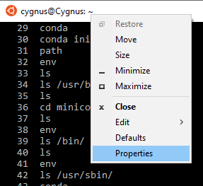
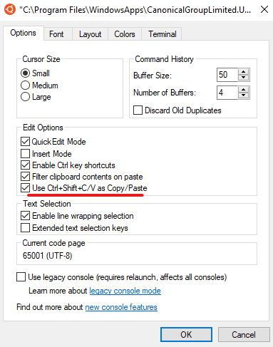
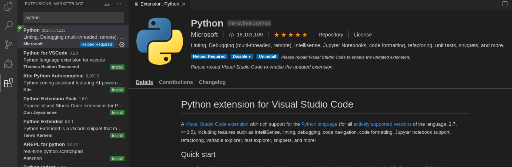
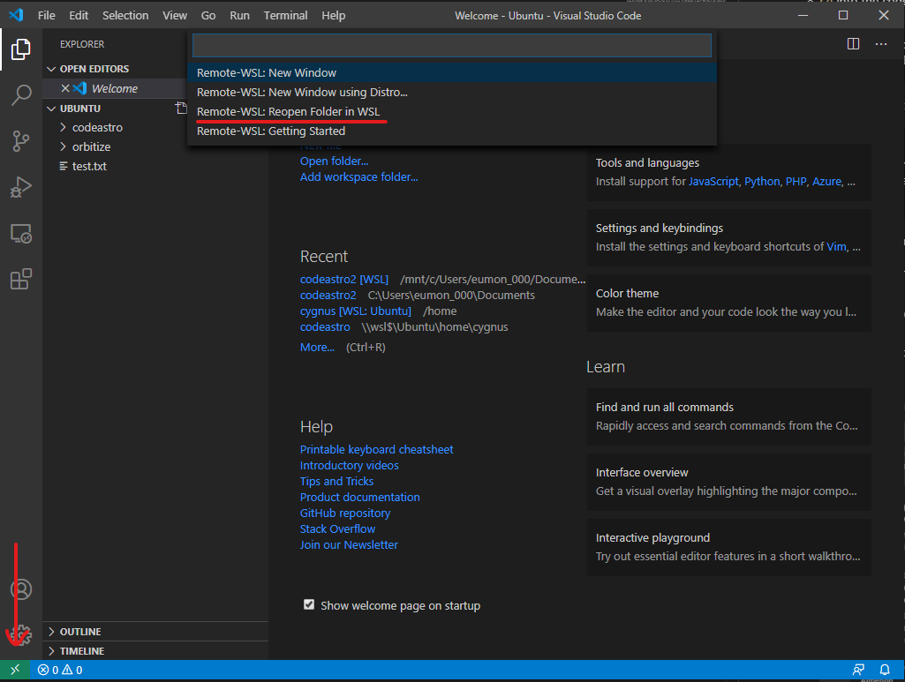
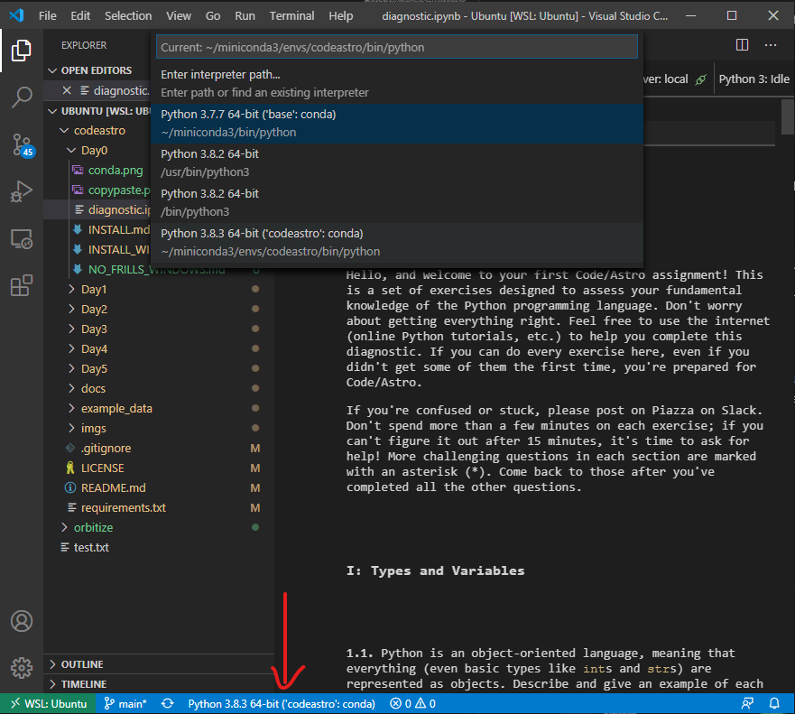

# No Frills Windows Environment Set-Up

This guide assumes you're using and have already installed WSL.

---
**TIP**

To enable copy/paste between your windows and wsl, right click on the WSL window, click on properties, and check "Use Ctrl+Shift+C/V as Copy/Paste". See photos below.

 

---

Before we begin create a directory for codeastro. Just go to your file explorer and make a folder somewhere. This will be separate from your github, this will serve as a home directory for your linux. For example mine is in `C:\Users\cygnus\Documents\Ubuntu`. 

These steps are for when you've just finished downloading WSL and opened up your Linux distro (probably Ubuntu so I'm going to call it Ubuntu from now on) for the first time. 

1. Create your user. This is important or you'll be running everything as root and jupyter doesn't like that. This should happen automatically when you first start up your Ubuntu. 
2. Link your home to the directory your created above. For my example above:

    `ln -s /mnt/c/Users/cygnus/Documents/Ubuntu/ ~/`

    This will link the directory we created at the beginning to a new directory in your home in Ubuntu (`~/Ubuntu` or your `/home/[USERNAME]/Ubuntu`). This is useful for managing your stuff for this project. Now anything we do in this Ubuntu's home will happen if your linked directory! They are... well, linked!
3. Let's get your conda install. Either download it and move it over with 

    `cp /mnt/c/Users/[USERNAME]/Downloads/Miniconda3-latest-Linux-x86_64.sh ~` 

    or run a `wget` command to get it directly if you have the link to the script (right click, copy link address). So in my case:

    `wget https://repo.anaconda.com/miniconda/Miniconda3-latest-Linux-x86_64.sh`
4. Run the script in silent mode (no prompts). and run an init.

    ```
    bash ~/Miniconda3-latest-Linux-x86_64.sh -b -p ~/miniconda3
    conda init
    ```

5. Restart your Ubuntu terminal and confirm that conda has been configured properly. 

    `conda -V`

    Should return something like 

    `conda 4.8.3`
6. Create the codeastro environment in conda and activate it when done.
    ```
    conda create -n codeastro python=3
    ...
    conda activate codeastro 
    ```
7. Get some packages we need
    
    `conda install numpy mkl jupyter`
8. Clone the codeastro git repo.

    ```
    cd Ubuntu
    git clone https://github.com/semaphoreP/codeastro.git
    ```
9. `cd` into the codeastro git repo and install the required packages
    ```
    cd codeastro
    pip install -r requirements.txt
    ```
10. Get the `orbitize` git repo and test it.
    ```
    cd ..
    git clone https://github.com/sblunt/orbitize.git
    cd orbitize
    py.test
    ```
    You may get some warnings, but you should see 0 errors if your setup is working.
    
Congratulations, you have a working Windows (read: Linux) environment!

## Optional (VS Code)
11. Download VSCode. Linky: https://code.visualstudio.com/
12. Get the `Remote - WSL` and the `Python` plugins. Click on the 4 squares on the bottom of the left panel to get to the package marketplace (Highlighted in white in image below).

13. Click `Open folder...` and open the folder we made in the beginning. In my example `C:\Users\cygnus\Documents\Ubuntu`. Since it's linked with the folder we made in Ubuntu you should see `codeastro` and `orbitize`. Click on the green button on the bottom left to open a session with remote WSL. Select the option to reopen the folder. 

    
14. Open one of the ipython notebooks and make sure you're using the `'codeastro':conda` environment in the bottom next to the WSL option. 

    


## TL;DR
Fill in the `[]`

Create folder in `C:\Users\[USERNAME]\Documents\Ubuntu`
```
ln -s /mnt/c/Users/[USERNAME]/Documents/Ubuntu/ ~/
wget https://repo.anaconda.com/miniconda/Miniconda3-latest-Linux-x86_64.sh # use the correct link. This is for 64bit. 
bash ~/Miniconda3-latest-Linux-x86_64.sh -b -p ~/miniconda3 # Again, use the correct script name. This is still 64.
conda init
```
Restart Ubuntu terminal. 
```
conda create -n codeastro python=3
conda activate codeastro
conda install numpy mkl jupyter
cd Ubuntu
git clone https://github.com/semaphoreP/codeastro.git
cd codeastro
pip install -r requirements.txt
cd ..
git clone https://github.com/sblunt/orbitize.git
cd orbitize
py.test
```
