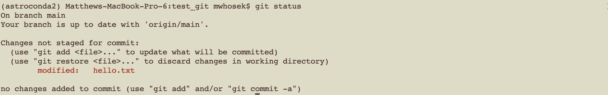
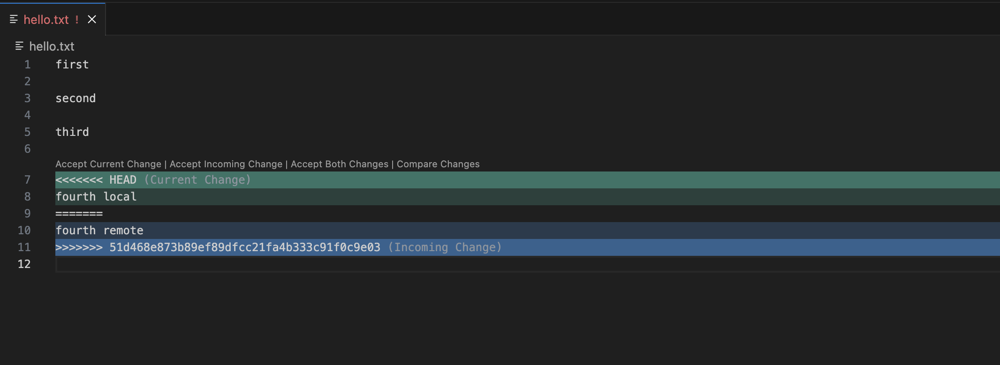

# Demo: Introduction to Git
In this demo, we will go over how to (1) make a git repository via
Github and clone it to your local machine; (2) Add and edit files to
the repo; (3) Resolve conflicts between the remote and local versions
of files in the repo; and (4) Remove changes you don't want to keep.

For this demo, you will need 3 applications running: a web-browser
with the Github webpage (where you have logged into your account), 
a terminal window, and then your favorite text editor. 

## Make a Remote Repository via Github

1. After logging into github, click the `Repositories` tab at the top
   of the page and then click the `New` green button to the upper right.

2. Assign your new repo anything you wish, and then configure
   some of the basic settings. For this demo, we'll set the code to be
   public (the default selection) and then click the box to `Add a
   README file`. When complete, click the green `Create Repository`
   button to the bottom right of the page.
   
   This process creates the repo on github and assigns it a web
   address. This is referred to as the `remote repository` or `origin`.
   
## Clone a Local Copy of the Repository to Your Machine
3. Now that the github repo is created, we need to copy a version of
   it to our local machine. This process is called "cloning". To clone
   the repo, click the green `Code` button, and copy the HTTPS address
   for the repo.

   Then, in your terminal window, navigate to wherever
   you'd like the repo to live on your local machine and type the
   following. This will create a new directory on your local machine with the same name as the repo. 
   
```
git clone <HTTPS_address_for_repo>
```

4. To make sure everything worked properly, `cd` into the newly
   created directory on your machine and type:
   
```
git status
```

This should tell us that (1) we are in a git repository on the `main`
branch and (2) our local repo is up-to-date with `main` on the remote
repo:

<p align="center">
  
</p>


## Adding a File to Your Repo 

5. Now, let's make a new text file to add to the repo directory on
   your machine. For this demo, we'll make a file called `hello.txt`
   and add some text to it. The next step is to tell git that this new
   file should be added to the git repo, which is done by:

```
git add hello.txt
```

Note that at this point, this file only exists on your local machine,
and doesn't yet exist in the github repo page. Next we need to
"commit" the change, and add a short message as to what the change we
are making is:

```
git commit hello.txt -m 'First commit of file'
```

6. Next we are ready to "push" this change to the github repo. This is
   done by:
   
```
git push origin main
```

In this command, remember that `origin` means the remote
repository (the one we made on Github), while `main` is the name of
the branch on the remote repository that we want to push the changes
to. In the future, there may be cases
where you want to push the changes to a different branch other than
`main`, but we'll talk about that in a future demo.

Now, go to your refresh the github webpage for your repo. You should
see that `hello.txt` now appears. 

## Editing a File in Your Repo

7. Let's make a change to `hello.txt` on our local machine by adding
   some text. 
   
    Git will notice that `hello.txt` is now different between your local
machine and the origin. If you type `git status`, it will tell you
that the file has been modified but these changes haven't been committed yet:
   
<p align="center">
  
</p>
   
   
Further, Git can tell us exactly what the difference is between our local copy of `hello.txt` and the version on the repo. By typing:
   
```
git diff hello.txt
```

It will return the lines of the file that have been changed. This is
very helpful if you've lost track of what changes you've done that haven't been committed yet.

<p align="center">
  
</p>

8. Just like in steps 4 and 5, we can commit these changes and then
   push them to the remote repository:
   
```
git commit hello.txt -m 'Adding new word'
git push origin main
```
   
   And now `hello.txt` will be changed on the remote repo, as you can
   see if you reload the Github page. You can see a history of all of
   the changes made to `hello.txt` (in the form of commits) by
   clicking on the file name and then clicking on the `History` on the
   upper right.


## Pulling Changes From the Remote Repo

9. Sometimes a file on the remote repo is updated, and you want to
   add those upates to the file on your local machine. To simulate
   this, let's make a change to `hello.txt` via the Github interface.

    To get these change on our local repo, we can use:
	
```
git pull origin main
```

Now, the local copy of `hello.txt` on your machine should reflect those changes. 
  
NOTE: You will not be able to use `git pull` if git detects that there
are changes to your local version of the repo that hasn't been
committed! This is safety measure to make sure any local changes you
have don't get accidently overwritten when we pull down from the 
remote repo. So, it is a good idea to run a quick `git status` to
see if you have any uncommitted local changes before using git pull.
  
## Resolving Conflicts
  
10. Sometimes, there will be a conflict between an update to a file on
    the remote repo and an update to a file on your local machine. In
    that case, git isn't sure which change to keep, and a conflict is
    raised. For example, let's manufacture a conflict in `hello.txt`.
    We'll edit the file on the remote repo directly via the Github
    interface, and then edit the file locally on our machine. Remember
    to `git commit` the local changes.
	
    Now, if you try to `git push` the local changes, there is a conflict
warning:

<p align="center">
  
</p>
	
If this happens, then the first thing we need to do is pull down the remote repo in order to see the conflict:
  
```
git pull origin main
```
	
Git will then find the lines of the file that are in conflict and
mark them on our local version like this:

<p align="center">
  
</p>

We can now edit the file by deciding which of the lines of the
  conflict we want to keep. Then, be sure to delete the extra lines added by Git (e.g., the `HEAD`, `>>>`, `<<<<`, and `====` markers).

To push the fixed file back to the remote repo, we do the following:

```
git add hello.txt
git commit -m 'fixing conflict'
git push origin master
```
	
And now everything is back to normal.
	
## Uh Oh, I Don't Want To Keep My Changes. Undo!!
One of the key advantages of git is that it allows us to keep track of
and undo changes that we decide we don't actually want to keep. Here
are three situations with commands you can use to undo these changes:

### Deleting Uncommitted Local Changed
If you want to remove all local changes made to a file, and you
haven't commited any of those changes yet, then you can easily revert
back to the previous commited version of the file by using:

```
git checkout <file_name>
```

### Preserving Local Changes but also Updating From Remote
This comes up if there are changes to the remote repo that you want to
pull down to your local repo, but you have local changes that aren't
ready to be committed yet (remember that git won't let you `git pull`
if detects local changes). In this case, we can use:

```
git stash
git pull origin main
git stash apply
```

`git stash` tells git to store your local changes elsewhere for the
time being. Then, it will allow you to pull down changes in the remote
repo. Then, you can "bring back" your local changes by using `git
stash apply`.

NOTE: using `git stash apply` can cause a merge conflict! In that
case, the conflict is marked in the file and you will need to resolve
it as we showed earlier.

### Reverting to An Earlier Commit
Let's say we want to revert a file to a version from an earlier
commit. Under the hood, git stores each commit that can be referred to
by a special ID. We can see the ID of each commit by using:

```
git log
```

This will list the commits (from most recent to oldest), along with
the ID for each.

Once we've chosen an earlier commit we want to go to, we can revert
to it via:

```
git revert <ID>
```

We'll talk more about `git revert` later in the workshop.


