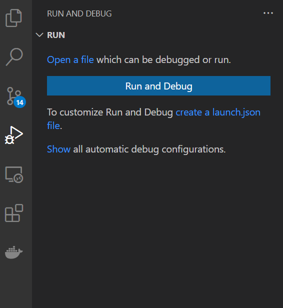
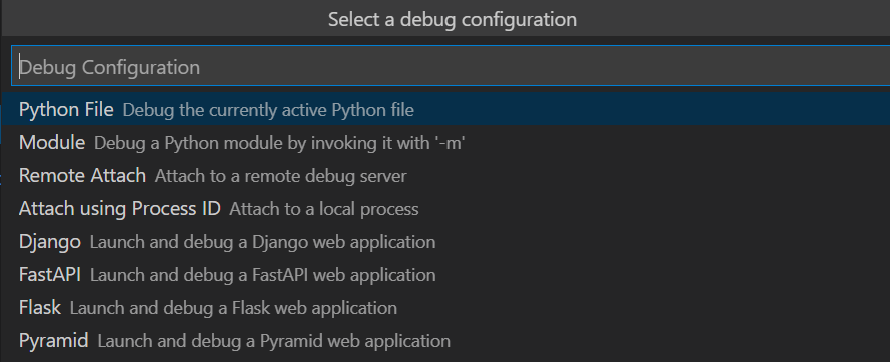

# Day 2

## Project Goal:

Get comfortable using GitHub to collaborate on your package.

Example: today we’ll put our code on GitHub and begin using branches to make further changes. We’ll continue working on the core functionality we sketched out yesterday (perhaps today we’ll add code to query the Gaia database using our list).
 
## Learning Objectives

  * Use git to contribute version-controlled code
  * Be able to define "git flow," and give examples of the advantages of git flow
  * Interactively debug code using breakpoints, and not rely on print statements

## Useful Links

  * [Day 2 Slides](https://docs.google.com/presentation/d/10IKCRv5o6HdklML1FllrqFRuxg_hzMNYMDECw6eaMBs/edit?usp=sharing)
  * Mechanics of Git: [.PDF]https://drive.google.com/file/d/1BJ7A4sMwzXcusxkn-av8tlwDmGla-lOv/view?usp=sharing), [.PPTX](https://docs.google.com/presentation/d/1gUhhCUs46kROxtyEA4dCusGg0LM35-fc/edit?usp=sharing&ouid=108304133850943478559&rtpof=true&sd=true)
    * 1 person should be the facilitator: keep track of time, stay on track, and keep track of progress
    * 1 person should be the recorder: writes down the solution (suggestion: use powerpoint, keynote, or google slides to draw out the git commit tree)
  * Fix this orbitize! bug: https://github.com/sblunt/orbitize/issues/230

## Debug orbitize!

The issue you are tasked with investigating is this one: https://github.com/sblunt/orbitize/issues/230. To do so, download a development version of orbitize! for the debugging activity. 

    git clone https://github.com/sblunt/orbitize.git

Next, we'll want to override your system's default `orbitize!` installation with this one. Install `orbitize!` from source by `cd`-ing into this repo you just cloned (there should be a requirements.txt file) and running:

    pip install -r requirements.txt -e .

That command just ran pip to install the package in the current directory, and to automatically update when you make changes to the code (useful for developing on packages). Installing code from source like this also allows you to use the interactive debugger in VS Code on the `orbitize!` source code by default. 

Next, get the VS Code debugger set up to run the `broken_orbitize.py` script that reproduces the bug. You can also write your own debug script if you prefer. If you have not set up the debugger before, open up the `broken_orbitize.py` file, then open the debug tab from the left side (4th buttom from top). Click the "create a launch.json file" link shown in the screenshot below:

When you click it, a dropdown link should appear to ask you what kind of debugging you would like to do, and select "Python File":

This should create a file `.vscode/launch.json` in the base directory, with default settings for debugging a Python file. We are now almost ready, but I suggest adding the following line inside the configurations list:

    "cwd": "${fileDirname}"

This makes it so that the current working directory of the debugger will always be the directory that the Python file you are debugging is located in. To check you set it all up correctly, it should look nearly identical to the `demo_launch.json` file in the Day2 folder. 

Now that you are set up, use the VS Code debugger to try to identify which input(s) is/are causing the function to return NaN, and if you have time, suggest a fix. Use this as an opportunity to get familiar with using the interactive controls (step into, and step over) and/or breakpoints!

If you aren't able to step into `calc_orbit()`, you may need to add the following line to your launch.json file:

     "justMyCode": false

### Instructions

  * Follow the instructions above to set up the debugger on your machine and use it on the `broken_orbitize.py` script
  * Reproduce the error: run the code and verify the assertion in the script fails
  * Identify which of the nine inputs is/are causing the function to return NaN
    * step into the `calc_orbit` function
    * identify the line when NaNs first start appearing
    * what variable needs to be changed on this line to prevent the NaNs from being created?
  * (Optional) Modify the code to prevent this from happening in the future

### End Product
Report on Piazza the follow two items:
  * In what line of `orbitize!` do NaNs first start appearing?
  * Which of the nine inputs is/are cuasing the function to return NaN, and report on any modifications you made

### Roles
  * Driver: in charge of sharing their screen and typing the code for this activity
  * Navigator: in charge of directing the driver what to code (everyone else; can be more than one person)

## Debugging Principles

There is no one recipe for debugging. However, here are some general tips for debugging that you might find useful

  * If you have no idea what is broken, establish what is working and try to use process of elimination.
  * A good process of elimination method is binary search: see if it is the first half of the code that is breaking things, or the second half. If it's the first half, then check the first quarter vs the second quarter. Keep repeating and isolating the error this way.
  * Google error messages, especially if they are specific, to see if anyone else has hints or leads. However, do think about what commands they are suggesting you type, and don't blindly type them!
  * Learn to use interactive debuggers like the one in VS Code, which allows you to step through code line by line and stop at places of intereset. It is really useful when you have a lot of lines of code to sift through.  
  * Write tests for your function as you are writing the function so you can use them to debug your code (this is called test-driven development). It will also help clarify to yourself what exactly each function should do. 
  * Keep at it! You will develop an intuition for debugging as you do more of it. 
