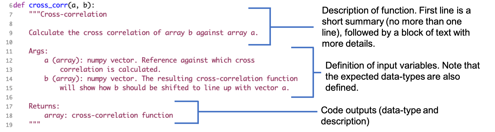

# Python Docstrings
A docstring is a string that appears in the first line of a function
or class that provides an overview of its purpose, a description of
the input variables it expects, and an explanation of the outputs
produced. There are several common styles of python
docstrings (see examples
[here](https://betterprogramming.pub/3-different-docstring-formats-for-python-d27be81e0d68)),
but today we will focus on the Google Docstring. 

In the `exampledoc` directory, open `correlate.py` in your favorite
text editor. These functions have Google-style docstrings. Let's look at
the different components of the docstring for the `cross_corr` function:


<p align="center">
  
</p>


This example shows a docstring for a typical function. Docstrings for
specific cases (e.g., optional input variables, classes,
exceptions, etc) have some slight modifications to this general structure.
Example docstrings for these cases (and more!) can be found [here](https://sphinxcontrib-napoleon.readthedocs.io/en/latest/example_google.html).

In addition to providing crucial information, docstrings provide a standardized way to
document code that can be easily parsed by automated
documetation tools, like
[sphinx](https://www.sphinx-doc.org/en/master/). Let's try using
sphinx to build documentation for `correlate.py`!

# Sphinx quickstart guide

1. First, make sure that sphinx is installed.
```
$ pip install sphinx
```

2. Since we will be using the Google style of docstrings we need to install the `sphinx-napoleon` package as well (https://sphinxcontrib-napoleon.readthedocs.io/en/latest/). Lets also install the ReadTheDocs theme so that our documentation page looks nice when created.
```
$ pip install sphinxcontrib-napoleon sphinx-rtd-theme
```

3. In this example, we will create documentation for the function
`correlate.py`, which is located under the `Day3/exampledoc/` directory in
the codeastro repository. Start by using `cd` to move into the
`exampledoc` directory.

4. Now we are ready to initialize the documentation. Start by making a
`docs` directory in your repo. Then run `sphinx-quickstart` within `docs`:
```
$ mkdir docs
$ cd docs
$ sphinx-quickstart
```
Answer the questions when prompted on the terminal. You can answer `n` to the question: `Separate source and build directories?`.

This should create several files and directories in your `docs`
directory, as shown below.
```
$ ls
Makefile   _build     _static    _templates conf.py    index.rst  make.bat
```

5. Open `conf.py` in VScode or other editor. This is the configuration
file for the Sphinx documentation builder, which controls how Sphinx
processes your code.

First, we'll need to uncomment
the following lines in the "Path setup" section. This path tells Sphinx
where your python files are located.
```
# import os
# import sys
# sys.path.insert(0, os.path.abspath('.'))
```

6. Change the `os.path.abspath('.')` part to point to the top level of
the `exampledocs` directory (where `correlate.py` lives). In this example that would be `..`.
```
import os
import sys
sys.path.insert(0, os.path.abspath('..'))
```

7. Make several additional changes to the conf.py file:
* Add the line `root_doc = 'index'` below your author name. This
  defines the main page of your documentation to be 'index.rst" (which
  was automatically generated by `sphinx-quickstart` in step 4). The
  root page contains the
  table of contents for your package (more on that later)
* Also add “sphinx.ext.autodoc” and "sphinx.ext.napoleon" to the `extensions`
   list in `conf.py`. "spinx.ext.autodoc" gives sphinx the power to
   read your python files and automatically extract the
   docstrings. "sphinx.ext.napoleon" allows sphinx to understand
   google-style docstrings.
* Finally, change the `html_theme` variable to
  "sphinx_rtd_theme". This defines the style of the documentation
  webpages. Here, we use the ReadtheDocs format. But, many others are
  availabe (see examples [here](https://www.sphinx-doc.org/en/master/usage/theming.html))


<p align="center">
  
</p>

8. Now we are ready to build the documentation pages! Do this from the `docs` directory.
```
$ make html
```

This will create a basic set of documentation pages in `_build/html`. Open up the `index.html` with your favorite browser.


9. This page doesn't have any of the documentation for `correlate.py` yet, so lets add that. The content of these pages are
controlled by the `.rst` (reStructured text) files. In the `docs`
directory, create a new `.rst` file called `correlate.rst`. The contents of this file should look like this:
```
.. _correlation:

Correlation Functions
=====================

Function to perform correlations.

.. automodule:: correlate
   :members:
```
This will tell Sphinx automatically parse `correlate.py` and read
your docstrings in order to turn them into a nicely-formatted web
page. Here is a breakdown of what the different parts of this
   file mean:

<p align="center">
  
</p>

10. Link the correlate page to the index page by adding ``correlate.rst``
to ``index.rst`` under the "toctree" command. This puts
``correlate.rst`` in sphinx's table-of-contents.

<p align="center">
  
</p>


11. Run `make html` again to update the docs.

12. View your documentation by opening the file at
`_build/html/index.html`. You should now see a link to the Correlation
Functions page, which has the documentation for `correlate.py`.

# Tips and Tricks

* Remember to check out these [additional docstring
examples](https://sphinxcontrib-napoleon.readthedocs.io/en/latest/example_google.html),
which also how to handle specific cases such as optional input
variables, classes, exceptions, etc.

* .rst files offer many more text formatting options than what is shown in
  this example. Here is a nice
  [cheatsheet](https://bashtage.github.io/sphinx-material/rst-cheatsheet/rst-cheatsheet.html)
  with more options.

* Docstrings and .rst files can be very finicky regarding
syntax! How sphinx compiles your documentation can be sensitive to
indents, skipped lines, type of punctuation used, etc.

* In the example above, let's say we wanted to insert a link to the
  correlation function page somwhere (say, under the "Indicies and
  tables" sections of the index page). Now that the `correlate.rst` file has been added
  under the toctree, we can refer to its label:
```
Indices and tables
==================
We can make a link to the correlation page by referring to its label
  like this :ref:`correlation`.
  
* :ref:`genindex`
* :ref:`modindex`
* :ref:`search`

 ```

# Activity: Building Sphinx Documentation For Your Repository
1. Document at least one function in your package with a docstring. 
2. Set up sphinx documentation for your project repo and build the doc
page for your function(s). Make sure it builds correctly!
    * Hint: to begin, make a `docs` directory in your repo, just like
      step 4 in the example above. 
3. (If time) Trade with another group and try to use one of their functions/classes/methods that they have documented using their sphinx documentation.


## Bonus Afternoon Activity: Linking your Sphinx Documentation with ReadTheDocs
In most cases, we want to host our sphinx documentation online so that
other users can access it easily. If your code is in a GitHub repo, is
public, 
and has sphinx documentation set up as above,
then you can host your documentation via
[ReadTheDocs](https://readthedocs.org/). One very nice aspect of
ReadTheDocs is that you can have it automatically recompile
the documentation each time a change is pushed to your code
repository. Just like that, you have documentation that updates
itself!

ReadtheDocs provides a nice
[tutorial](https://docs.readthedocs.io/en/stable/tutorial/) on how to
set it up. You will need to:

1. Make a free ReadTheDocs account and authorize it to access your
GitHub account ("Sign Up for Read the Docs")

2. Import your repository as a new ReadTheDocs project ("Import the
   Project for Read the Docs")

3. Build your documentation; make sure it runs to completion and that
the output webpage looks the way you expect it to ("Checking the First Build")

4. Set it up so that the docs are automatically recompiled if a push
is made to the github repo. In the ReadtheDocs project page,
click on the `Advanced Settings` link on the left under the `Admin`
menu, check the “Build pull requests for this project” checkbox,
and click the Save button at the bottom of the page. (From "Trigger a
Build from a pull request"). 


