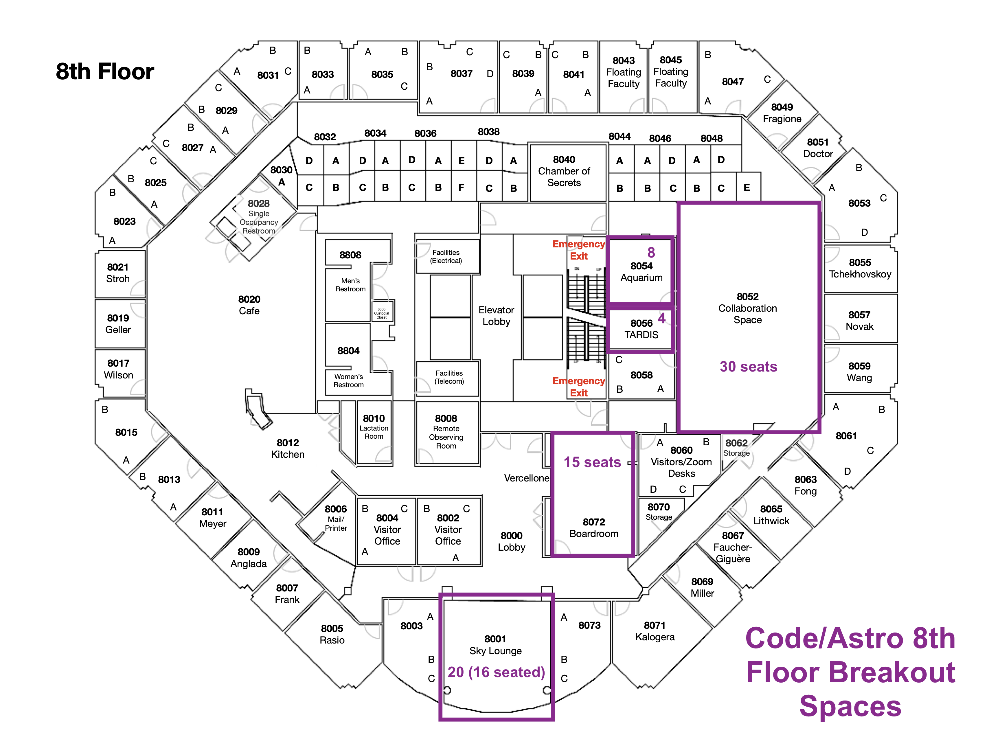
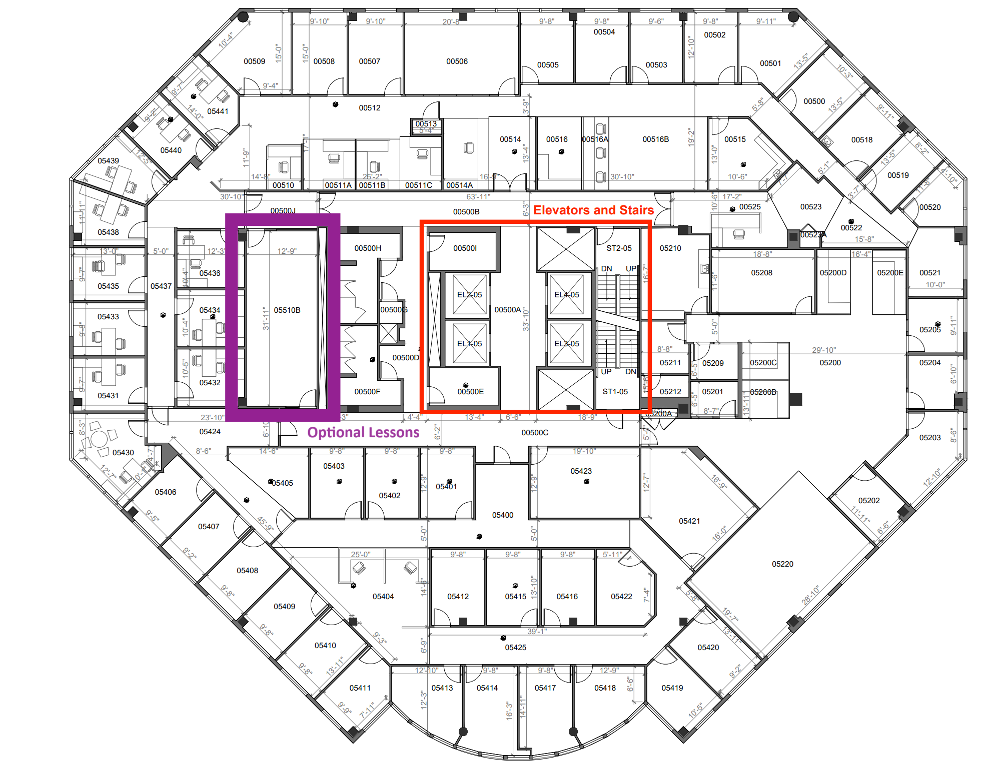
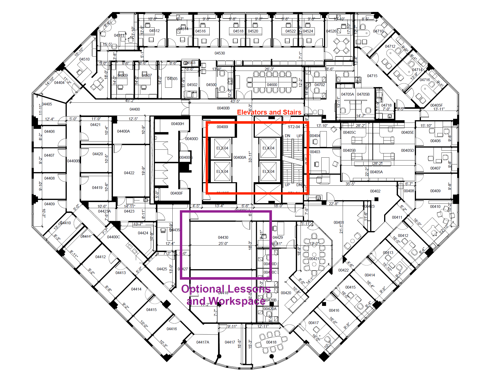
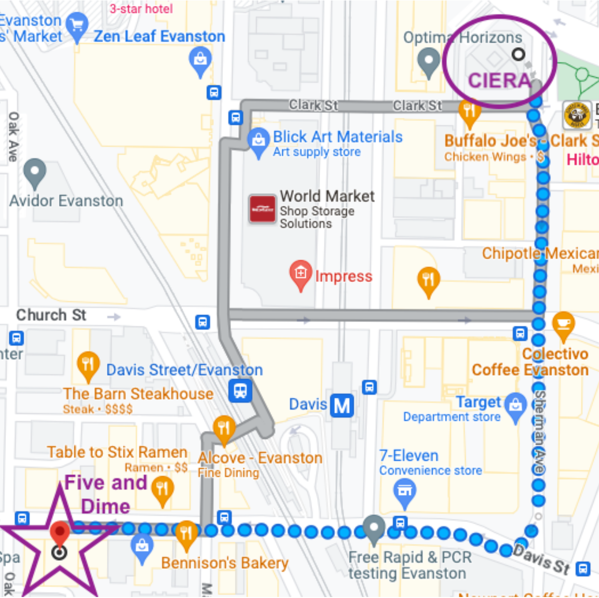

# Workshop Details

## Agenda

All dates and times are CDT (Chicago Time). Please note that the exact timing of the morning activities may change.  

**Monday July 15**

|   Time   | Activity  | Room  | 
| :------------ | :------------ | :-------------- |
|  8:30am - 9:00am | Breakfast         | 7-600 (7th Floor, 1800 Sherman)     |
|  9:00am - 9:45am     | Welcome  | 7-600 (7th Floor, 1800 Sherman)    | 
|  9:50am - 10:00am     | Development Environments  | 7-600 (7th Floor, 1800 Sherman)    | 
|  10:00am - 10:50am     | Programming Paradigms  | 7-600 (7th Floor, 1800 Sherman)    | 
|  11:00am - 11:30am     | Git/Github Basics  | 7-600 (7th Floor, 1800 Sherman)    | 
|  11:30am - 12:00pm     | Gitflow  | 7-600 (7th Floor, 1800 Sherman)    | 
|  12:00pm - 1:00pm       | Lunch | On Your Own (see below for restaurants)        | 
|  1:00pm - 5:00pm      | Work on Project  | 8th Floor Spaces (see below) | 
|  2:00pm - 3:00pm | (Optional) Numpy/Pandas |  4-430  |
|  3:00pm - 4:00pm | (Optional) Matplotlib |  4-430  |
|  4:00pm - 5:00pm | (Optional) Astropy |  4-430  |

**Tuesday July 16**

|   Time   | Activity  | Room  | 
| :------------ | :------------ | :-------------- |
|  8:30am - 9:00am | Breakfast         | 7-600 (7th Floor, 1800 Sherman)     |
|  9:00am - 9:15am     | Welcome  | 7-600 (7th Floor, 1800 Sherman)    | 
|  9:15am - 9:40am     | Gitflow Continued  | 7-600 (7th Floor, 1800 Sherman)    | 
|  9:45am - 10:50am     | Mechanics of Git  | 7-600 (7th Floor, 1800 Sherman)    | 
|  11:00am - 11:55am     | Debugging  | 7-600 (7th Floor, 1800 Sherman)    | 
|  11:55am - 12:00pm     | Group Photo  | 7-600 (7th Floor, 1800 Sherman)    | 
|  12:00pm - 1:00pm       | Lunch | On Your Own (see below for restaurants)        | 
|  1:00pm - 5:00pm      | Work on Project  | 8th Floor Spaces (see below)   | 
|  2:00pm - 3:00pm | (Optional) Parallel Programming | 5-510  |
|  3:00pm - 4:00pm | (Optional) jax | 5-510  |

**Wednesday July 17**

|   Time   | Activity  | Room  | 
| :------------ | :------------ | :-------------- |
|  8:30am - 9:00am | Breakfast         | 7-600 (7th Floor, 1800 Sherman)     |
|  9:00am - 9:15am     | Welcome  | 7-600 (7th Floor, 1800 Sherman)    | 
|  9:15am - 10:30am     | Releasing Code  | 7-600 (7th Floor, 1800 Sherman)    | 
|  10:40am - 12:00pm     | Documentation  | 7-600 (7th Floor, 1800 Sherman)    | 
|  12:00pm - 6:30pm       | Free-time | On Your Own    | 
|  6:30pm - 9:00pm     | Workshop Dinner  | [Five and Dime](https://www.google.com/maps/place/Five+%26+Dime/@42.0485969,-87.6866502,17z/data=!3m1!5s0x880fd00fbd24232f:0x3405ad57c073f3bf!4m6!3m5!1s0x880fd00fbd281f2b:0x225529537d95fd0a!8m2!3d42.0468628!4d-87.6863463!16s%2Fg%2F11c0rl46wt?entry=ttu)       | 

**Thursday July 18**

|   Time   | Activity  | Room  | 
| :------------ | :------------ | :-------------- |
|  8:30am - 9:00am | Breakfast         | 7-600 (7th Floor, 1800 Sherman)     |
|  9:00am - 9:15am     | Welcome  | 7-600 (7th Floor, 1800 Sherman)    | 
|  9:15am - 11:15am     | Testing  | 7-600 (7th Floor, 1800 Sherman)    |  
|  11:25am - 12:00pm     | Anti-Discriminatory Practices  | 7-600 (7th Floor, 1800 Sherman)    | 
|  12:00pm - 1:00pm       | Lunch | On Your Own (see below for restaurants)        | 
|  1:00pm - 5:00pm      | Work on Project  | 8th Floor Spaces (see below)  | 
|  2:00pm - 3:00pm | (Optional) Profiling | 4-430   |
|  3:00pm - 4:00pm | (Optional) Supplementary Tools | 4-430   |

**Friday July 19**

|   Time   | Activity  | Room  | 
| :------------ | :------------ | :-------------- |
|  8:30am - 9:00am | Breakfast         | 7-600 (7th Floor, 1800 Sherman)     |
|  9:00am - 10:00am    | Industry Panel               | 7-600 (7th Floor, 1800 Sherman)    | 
|  10:00am - 11:45am    | Group Project Show & Tell              | 7-600 (7th Floor, 1800 Sherman)    | 
|  11:45am - 12:00pm       | Closing Remarks |  7-600 (7th Floor, 1800 Sherman)         | 

## Recording Policy
We are going to record to workshop to enable broader access to the materials from Code/Astro. We will share the recordings publicly on Youtube. By attending Code/Astro either in-person or remotely, you consent to being recorded. Please contact us if you wish to be removed from recordings.

## In-Person Logistics 

Code/Astro will be held in [1800 Sherman Ave, Evanston, IL 60201](https://www.google.com/maps/place/1800+Sherman+Ave,+Evanston,+IL+60201/@42.050331,-87.6846099,17z/data=!3m1!4b1!4m6!3m5!1s0x880fd00bfa3632f3:0x8d6a9629f47228ab!8m2!3d42.050331!4d-87.682035!16s%2Fg%2F1thtdqy6?entry=ttu).
Breakfast and the morning sessions will be held in Room 7-600, a big conference room on the 7th floor of 1800 Sherman. 
Lunch is on-your-own, but you are located right across the street from downtown Evanston, so you should have plenty of options (see below for more information).
We have several spaces on the 8th floor in 1800 Sherman for you to work on your 
groups projects in the afternoon in (see below for more information). 
The instructors and TAs will be available there in the afternoon in those rooms to help answer any
questions, or discuss your project with you.

There will be nothing planned on Wednesday afternoon (although the rooms are available if you want to work on your project), as this gives you an opportunity to have some time to explore Evanston and Chicago.
We will also host a workshop dinner on Wednesday evening at 6:30pm at Five and Dime, which is located in downtown Evanston. 

### COVID Policy
Masking is optional. If you do test positive for COVID, please let us know and attend the workshop remotely. We can cover costs for you to properly quarantine in a hotel room until you recover. 

### In-Person Rooms
All synchronous activities in the morning will be held on the 7th floor. Group work spaces are located on the 8th floor. Spaces are first-come-first-serve, so you and your group should decide where you want to work.

Below are maps of the rooms in each floor. Please let us know if there are insufficient plugs, and we can bring more. Please keep the areas clean as these are shared areas!

| Floor | Map|
|-------|----|
| [8th Floor](imgs/Code-Astro-Floorplan-2024.png) |  |
| [7th Floor](imgs/ciera-meetingrooms-7thfloor.png) |  |
| [5th Floor](imgs/ciera-meetingrooms-5thfloor.png) |  |
| [4th Floor](imgs/ciera-meetingrooms-4thfloor.png) |  |

### Workshop Dinner
The workshop dinner will be taking place at [Five and Dime at 1026 Davis Street (9 min walk from CIERA)](https://www.google.com/maps/place/Five+%26+Dime/@42.0485969,-87.6866502,17z/data=!3m1!5s0x880fd00fbd24232f:0x3405ad57c073f3bf!4m6!3m5!1s0x880fd00fbd281f2b:0x225529537d95fd0a!8m2!3d42.0468628!4d-87.6863463!16s%2Fg%2F11c0rl46wt?entry=ttu). Walking instructions from CIERA are below:

The workshop dinner will begin at 6:30pm. Service will be buffet style. Food and water is included, alcoholic drinks can be purchased independently at the bar. 

### Getting to Evanston from O'Hare International Airport
O’Hare International Airport to Evanston

#### Public Transportation
The cheapest way to get to Evanston from O’Hare International Airport is by taking public transportation.

**Chicago Transit Authority (busses and the elevated train)**

[Option 1](https://www.google.com/maps/dir/Arrivals+-+Terminal+3,+Chicago,+IL+60666/Holiday+Inn,+Sherman+Avenue,+Evanston,+IL,+USA/@41.9606592,-87.8475158,12z/data=!3m1!4b1!4m16!4m15!1m5!1m1!1s0x880fb429075bccf1:0xe97fe9a07e487131!2m2!1d-87.9013668!2d41.9773024!1m5!1m1!1s0x880fd01272ba5815:0xd55b621c49adcbd!2m2!1d-87.6816024!2d42.0443382!2m1!5e1!3e3?entry=ttu): Take the CTA metro trains straight from the airport terminals with at least one transfer near downtonwn (~2 hour). 

[Option 2](https://www.google.com/maps/dir/O'Hare+Multi-Modal+Facility+(MMF),+West+Zemke+Boulevard,+Chicago,+IL,+USA/Holiday+Inn,+Sherman+Avenue,+Evanston,+IL,+USA/@41.9627464,-87.8481529,12z/am=t/data=!3m1!4b1!4m17!4m16!1m5!1m1!1s0x880fb7005a24b8e7:0x3b633ca13fd54009!2m2!1d-87.8811754!2d41.9931771!1m5!1m1!1s0x880fd01272ba5815:0xd55b621c49adcbd!2m2!1d-87.6816024!2d42.0443382!2m1!5e1!3e3!5i5?entry=ttu): Take the O'Hare Airport Transit System to the Multi-Modal Facility/Rental Car Center. From outside of the Multi-Modal Facility, take the Pulse Dempster Line Bus straight to downtown Evanston (~1 hour and 20 minutes).

**Taxi/Uber/Lyft**

The fastest way to get to Evanston from O’Hare is by taking an Uber/Lyft/Taxi. Uber and Lyft drivers are authorized to pick up riders from designated pickup zones (viewable in the relevant app). Surge pricing may be in effect, but non-surge rates typically run around $60. The drive to CIERA can take anywhere between 25 minutes to an hour, depending on traffic. Alternatively, American Taxi can be pre-arranged and offers a flat rate of $42 from O’Hare to Evanston. To pre-arrange a ride, please call (847) 673-1000.

### Things to do in Evanston

#### Restaurants (by no means exhaustive)

**Quick Bites/Takeout**

Blaze Pizza, Jimmy John’s, Koko Table Korean, Soulwich, Edzo’s, Elephant and Vine, Sweetgreen, Colectivo Coffee, Habibi Mediterranean Grill, 10Q Chicken, Dozika, Chipotle, Potbelly’s, Noodles & Co.

**Sit Down/Dinner (many also offer takeout options) (^=more costly)**

Bat17, Mumbai Indian Grill, Chili’s, Stacked and Folded, Tapas Barcelona, Kansaku, TOMO, Koi, Trattoria Demi, Peppercorn’s Kitchen, Taco Diablo, Compagnola^, Oceanique^, Mt. Everest, Lou Malnati’s, The Barn Steakhouse^, LeTour^, Fonda, NaKorn Urban Thai

**Activities**

Day at Lake Michigan, Northwestern University Block Museum, Dearborn Observatory, Grosse Point Lighthouse, and much more!

### Things to do in Chicago
Downtown Chicago is roughly a 45 min -1 hour train ride from CIERA. Take the Purple Line at the Davis Stop southbound (Loop Direction) straight there, or transfer to the Red Line at Howard (95th/Dan Ryan Direction). 

See the Bean, the Sears (Willis) Tower, a Chicago Cubs or White Sox game, the Art Institute, Lake Michigan, an architectural boat tour from the Chicago River, and much, much more. Naturally not easy to make an exhaustive list of this, so check out these recommendations here:

[Tripadvisor](https://www.tripadvisor.com/Attractions-g35805-Activities-Chicago_Illinois.html)

[July Events Calendar](https://www.timeout.com/chicago/events-calendar)

[Travel and Leisure](https://www.travelandleisure.com/trip-ideas/city-vacations/best-things-to-do-in-chicago)

[US News and World Report](https://travel.usnews.com/Chicago_IL/Things_To_Do/)

