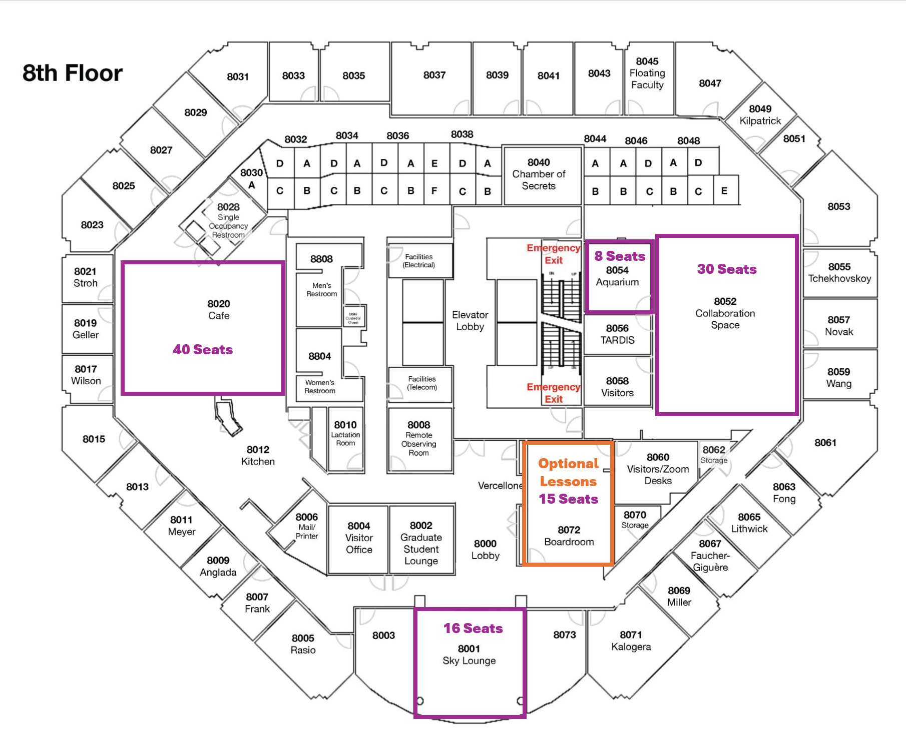

# Workshop Details

## Agenda

All dates and times are CDT (Chicago Time). Please note that the exact timing of the morning activities may change.  

**Monday August 4**

|   Time   | Activity  | Room  | 
| :------------ | :------------ | :-------------- |
|  8:30am - 9:00am | Breakfast         | LR2 (Technological Institute)     |
|  9:00am - 9:45am     | Welcome  | LR2 (Technological Institute)    | 
|  9:50am - 10:00am     | Development Environments  | LR2 (Technological Institute)    | 
|  10:00am - 10:50am     | Programming Paradigms  | LR2 (Technological Institute)    | 
|  11:00am - 11:30am     | Git/Github Basics  | LR2 (Technological Institute)    | 
|  11:30am - 12:00pm     | Gitflow  | LR2 (Technological Institute)    | 
|  12:00pm - 1:00pm       | Lunch | On Your Own (see below for restaurants)        | 
|  1:00pm - 5:00pm      | Work on Project  | 8th Floor Spaces (1800 Sherman) | 
|  2:00pm - 3:00pm | (Optional) Numpy/Pandas (Foundational) |  8072 (1800 Sherman)  |
|  3:00pm - 4:00pm | (Optional) Matplotlib  (Foundational) |  8072 (1800 Sherman)  |
|  4:00pm - 5:00pm | (Optional) jax  (Advanced)  |  8072 (1800 Sherman)  |

**Tuesday August 5**

|   Time   | Activity  | Room  | 
| :------------ | :------------ | :-------------- |
|  8:30am - 9:00am | Breakfast         | LR2 (Technological Institute)     |
|  9:00am - 9:15am     | Welcome  | LR2 (Technological Institute)    | 
|  9:15am - 9:40am     | Gitflow Continued  | LR2 (Technological Institute)    | 
|  9:45am - 10:50am     | Mechanics of Git  | LR2 (Technological Institute)    | 
|  11:00am - 11:55am     | Debugging  | LR2 (Technological Institute)    | 
|  11:55am - 12:00pm     | Group Photo  | LR2 (Technological Institute)    | 
|  12:00pm - 1:00pm       | Lunch | On Your Own (see below for restaurants)        | 
|  1:00pm - 5:00pm      | Work on Project  | 8th Floor Spaces (1800 Sherman)   | 
|  2:00pm - 3:00pm | (Optional) Parallel Programming (Advanced) | 8072 (1800 Sherman)  |
|  3:00pm - 4:00pm | (Optional) Astropy  (Foundational) | 8072 (1800 Sherman)  |

**Wednesday August 6**

|   Time   | Activity  | Room  | 
| :------------ | :------------ | :-------------- |
|  8:30am - 9:00am | Breakfast         | LR2 (Technological Institute)     |
|  9:00am - 9:15am     | Welcome  | LR2 (Technological Institute)    | 
|  9:15am - 10:30am     | Releasing Code  | LR2 (Technological Institute)    | 
|  10:40am - 12:00pm     | Documentation  | LR2 (Technological Institute)    | 
|  12:00pm - 6:30pm       | Free-time | On Your Own    | 
|  6:30pm - 9:00pm     | Workshop Dinner  | [Five and Dime](https://www.google.com/maps/place/Five+%26+Dime/@42.0485969,-87.6866502,17z/data=!3m1!5s0x880fd00fbd24232f:0x3405ad57c073f3bf!4m6!3m5!1s0x880fd00fbd281f2b:0x225529537d95fd0a!8m2!3d42.0468628!4d-87.6863463!16s%2Fg%2F11c0rl46wt?entry=ttu)       | 

**Thursday August 7**

|   Time   | Activity  | Room  | 
| :------------ | :------------ | :-------------- |
|  8:30am - 9:00am | Breakfast         | LR2 (Technological Institute)     |
|  9:00am - 9:15am     | Welcome  | LR2 (Technological Institute)    | 
|  9:15am - 11:15am     | Testing  | LR2 (Technological Institute)    |  
|  11:25am - 12:00pm     | Anti-Discriminatory Practices  | LR2 (Technological Institute)    | 
|  12:00pm - 1:00pm       | Lunch | On Your Own (see below for restaurants)        | 
|  1:00pm - 5:00pm      | Work on Project  | 8th Floor Spaces (1800 Sherman)  | 
|  2:00pm - 3:00pm | (Optional) Profiling  (Advanced) | 8072 (1800 Sherman)   |

**Friday August 8**

|   Time   | Activity  | Room  | 
| :------------ | :------------ | :-------------- |
|  8:30am - 9:00am | Breakfast         | LR2 (Technological Institute)     |
|  9:00am - 10:00am    | Industry Panel               | LR2 (Technological Institute)    | 
|  10:00am - 11:45am    | Group Project Show & Tell              | LR2 (Technological Institute)    | 
|  11:45am - 12:00pm       | Closing Remarks |  LR2 (Technological Institute)         | 

## Recording Policy
We are going to record to workshop to enable broader access to the materials from Code/Astro. We will share the recordings publicly on Youtube. By attending Code/Astro either in-person or remotely, you consent to being recorded. Please contact us if you wish to be removed from recordings.

## In-Person Logistics 

### Morning Session
Breakfast and the morning sessions will be held in the [Northwestern Technological Institute (often called "Tech")](https://g.co/kgs/V5suWjm), an auditorium located on the ground floor. Tech is a 25-minute walk from the Holiday Inn hotel. The 201 bus can also be used to arrive at Tech. Tech can be confusing to navigate, but there is a website called [Tech Room Finder](https://www.mccormick.northwestern.edu/contact/tech-room-finder-map.php?id=L171&room-floor=1&room-id=789&room-ingress=) to assist. 

### Lunch
Lunch is on-your-own (see below for more information). Note that it is a 20-minute walk to our afternoon location, but there are lunch options on Noyes St. and in Downtown Evanston that are only a small detour on the way there.

### Afternoon Session
Afternoon sessions will be held in [1800 Sherman Ave, Evanston, IL 60201](https://www.google.com/maps/place/1800+Sherman+Ave,+Evanston,+IL+60201/@42.050331,-87.6846099,17z/data=!3m1!4b1!4m6!3m5!1s0x880fd00bfa3632f3:0x8d6a9629f47228ab!8m2!3d42.050331!4d-87.682035!16s%2Fg%2F1thtdqy6?entry=ttu). We have several spaces on the 8th floor in 1800 Sherman for you to work on your 
groups projects in the afternoon in (see below for more information). 
The instructors and TAs will be available there in the afternoon in those rooms to help answer any
questions, or discuss your project with you.

There will be nothing planned on Wednesday afternoon (although the rooms are available if you want to work on your project), as this gives you an opportunity to have some time to explore Evanston and Chicago.
We will also host a workshop dinner on Wednesday evening at 6:30pm at Five and Dime, which is located in downtown Evanston. 

### COVID Policy
Masking is optional. If you do test positive for COVID, please let us know and attend the workshop remotely. We can cover costs for you to properly quarantine in a hotel room until you recover. 

### 1800 Sherman In-Person Rooms
1800 Sherman houses CIERA (the astronomy research unit at Northwestern), so you may bump into other astronomers. Group work spaces are located on the 8th floor. Spaces are first-come-first-serve, so you and your group should decide where you want to work.

Below are maps of the rooms in each floor. Please let us know if there are insufficient plugs, and we can bring more. Please keep the areas clean as these are shared areas!

| Floor | Map|
|-------|----|
| [8th Floor](imgs/Code-Astro-Floorplan-2024.png) |  |

### Workshop Dinner
The workshop dinner will be taking place at [Five and Dime at 1026 Davis Street (9 min walk from CIERA)](https://www.google.com/maps/place/Five+%26+Dime/@42.0485969,-87.6866502,17z/data=!3m1!5s0x880fd00fbd24232f:0x3405ad57c073f3bf!4m6!3m5!1s0x880fd00fbd281f2b:0x225529537d95fd0a!8m2!3d42.0468628!4d-87.6863463!16s%2Fg%2F11c0rl46wt?entry=ttu). Walking instructions from CIERA are below:

The workshop dinner will begin at 6:30pm. Service will be buffet style. Food and non-alcoholic drinks are included, alcoholic drinks can be purchased independently at the bar. 

### Getting to Evanston from O'Hare International Airport
O’Hare International Airport to Evanston

#### Public Transportation
The cheapest way to get to Evanston from O’Hare International Airport is by taking public transportation.

**Chicago Transit Authority (busses and the elevated train)**

[Option 1](https://maps.app.goo.gl/Lm78wjuFrEMx1bte9): Take the CTA metro trains straight from the airport terminals with at least one transfer near downtonwn (~2 hour). 

[Option 2](https://maps.app.goo.gl/yPQdienBosJGeact7): Take the O'Hare Airport Transit System to the Multi-Modal Facility/Rental Car Center. From outside of the Multi-Modal Facility, take the Pulse Dempster Line Bus (or 250 bus) straight to downtown Evanston (~1 hour and 20 minutes).

**Taxi/Uber/Lyft**

The fastest way to get to Evanston from O’Hare is by taking an Uber/Lyft/Taxi. Uber and Lyft drivers are authorized to pick up riders from designated pickup zones (viewable in the relevant app). Surge pricing may be in effect, but non-surge rates typically run around $60. The drive to CIERA can take anywhere between 25 minutes to an hour, depending on traffic. Alternatively, [American Taxi](https://www.americantaxi.com/) can be pre-arranged and offers a flat rate of $42 from O’Hare to Evanston. 

### Things to do in Evanston

#### Noyes St. Restauraunts

**Quick Bites/Takeout**
Inspired Indian Co., Tomate Fresh Kitchen, D&D Dogs, Coffee Lab

**Sit Down/Dinner (many also offer takeout options) (^=more costly)**
Stacked and Folded, Soban Korea, Dave's Italian Kitchen

#### Downtown Restaurants (by no means exhaustive)

**Quick Bites/Takeout**

Blaze Pizza, Jimmy John’s, Soulwich, Elephant and Vine, Sweetgreen, Colectivo Coffee, Habibi Mediterranean Grill, 10Q Chicken, Chipotle, Potbelly’s, Noodles & Co., Guzman y Gomez, Pono Ono Poke, Eggs with Benefits

**Sit Down/Dinner (many also offer takeout options) (^=more costly)**

Bat17, Koko Table Korean, Mumbai Indian Grill, Joy Yee Noodle, Chili’s, Stacked and Folded, Tapas Barcelona, Kansaku, TOMO, Koi, Trattoria Demi, Peppercorn’s Kitchen, Taco Diablo, Mt. Everest, Lou Malnati’s, The Barn Steakhouse^, LeTour^, Fonda, NaKorn Urban Thai, La Cocinita

**Activities**

Day at Lake Michigan, Northwestern University Block Museum, Dearborn Observatory, Grosse Point Lighthouse, Gichigamiin Indigenous Nations Museum

### Things to do in Chicago
Downtown Chicago is roughly a 45 min -1 hour train ride from CIERA. Take the Purple Line at the Davis Stop southbound (Loop Direction) straight there, or transfer to the Red Line at Howard (95th/Dan Ryan Direction). 

See the Bean, the Sears (Willis) Tower, a Chicago Cubs or White Sox game, the Art Institute, Lake Michigan, an architectural boat tour from the Chicago River, and much, much more. Naturally not easy to make an exhaustive list of this, so check out these recommendations here:

[Tripadvisor](https://www.tripadvisor.com/Attractions-g35805-Activities-Chicago_Illinois.html)

[Timeout.com Events Calendar](https://www.timeout.com/chicago/events-calendar)

[Travel and Leisure](https://www.travelandleisure.com/trip-ideas/city-vacations/best-things-to-do-in-chicago)

[US News and World Report](https://travel.usnews.com/Chicago_IL/Things_To_Do/)

