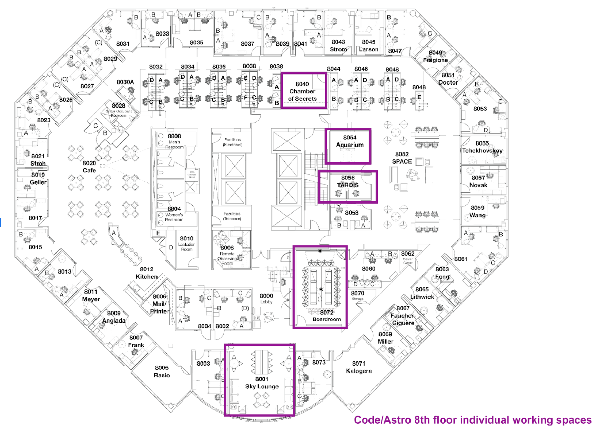
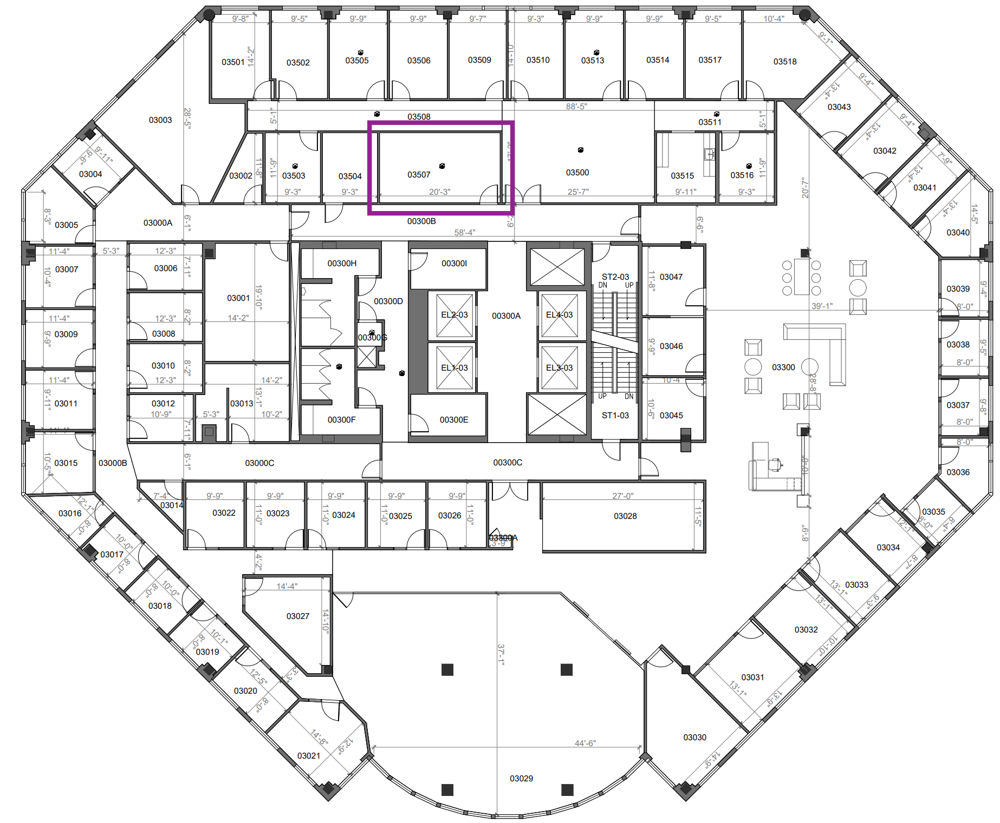
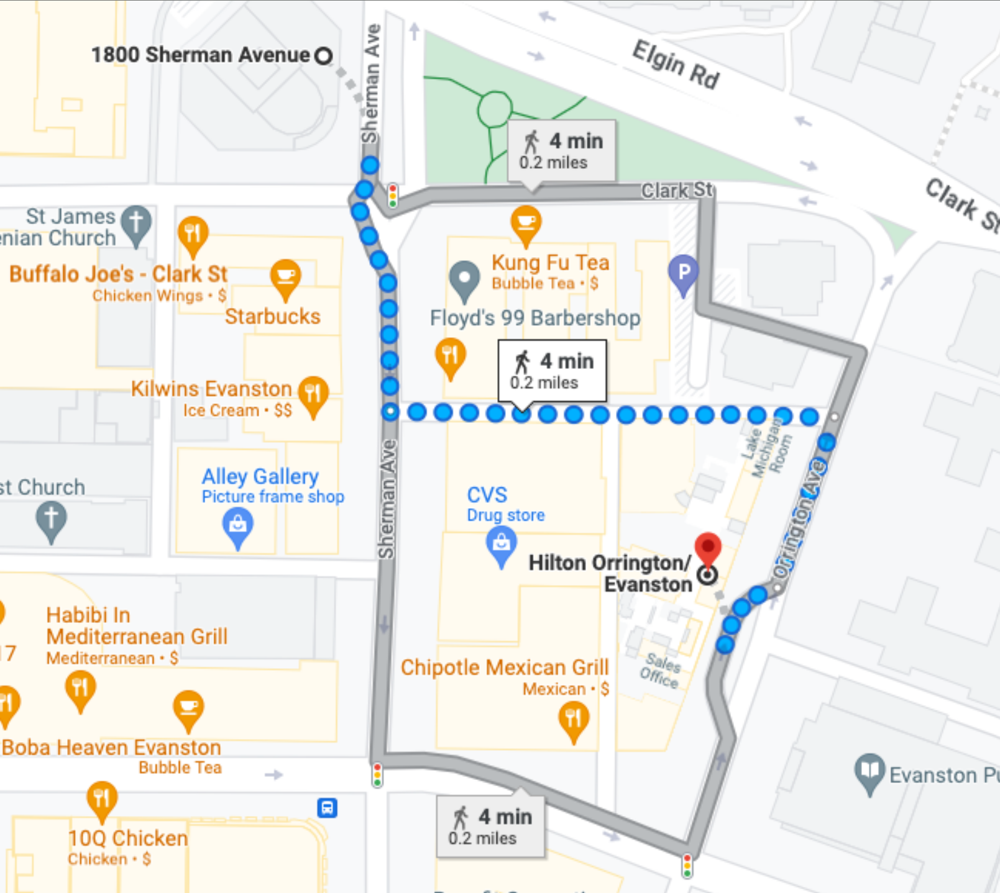

# Workshop Details

## Agenda

All dates and times are CDT (Chicago Time). Room information will be added shortly. 

**Monday July 10**

|   Time   | Activity  | Room  | 
| :------------ | :------------ | :-------------- |
|  8:30am - 9:00am | Breakfast         | 7-600 (7th Floor, 1800 Sherman)     |
|  9:00am - 12:00pm     | Synchronous Activities               | 7-600 (7th Floor, 1800 Sherman)    | 
|  12:00pm - 1:00pm       | Lunch | On Your Own (see below for restaurants)        | 
|  1:00pm - 2:00pm | (Optional) Parallelism |  4430 (4th Floor)  |
|  1:00pm - 5:00pm      | Work on Project  | Assorted Meeting Rooms (see below for room info)        | 

**Tuesday July 11**

|   Time   | Activity  | Room  | 
| :------------ | :------------ | :-------------- |
|  8:30am - 9:00am | Breakfast         | 7-600 (7th Floor, 1800 Sherman)     |
|  9:00am - 12:00pm     | Synchronous Activities               | 7-600 (7th Floor, 1800 Sherman)    | 
|  12:00pm - 1:00pm       | Lunch | On Your Own (see below for restaurants)        | 
|  1:00pm - 2:00pm | (Optional) astropy + matplotlib |  4430 (4th Floor)  |
|  1:00pm - 5:00pm      | Work on Project  | Assorted Meeting Rooms (see below for room info)        | 

**Wednesday July 12**

|   Time   | Activity  | Room  | 
| :------------ | :------------ | :-------------- |
|  8:30am - 9:00am | Breakfast         | 7-600 (7th Floor, 1800 Sherman)     |
|  9:00am - 12:00pm     | Synchronous Activities               | 7-600 (7th Floor, 1800 Sherman)    | 
|  12:00pm - 6:30pm       | Free-time | On Your Own    | 
|  6:30pm - 9:00pm     | Workshop Dinner  | [Five and Dime](https://www.google.com/maps/place/Five+%26+Dime/@42.0485969,-87.6866502,17z/data=!3m1!5s0x880fd00fbd24232f:0x3405ad57c073f3bf!4m6!3m5!1s0x880fd00fbd281f2b:0x225529537d95fd0a!8m2!3d42.0468628!4d-87.6863463!16s%2Fg%2F11c0rl46wt?entry=ttu)       | 

**Thursday July 13**

|   Time   | Activity  | Room  | 
| :------------ | :------------ | :-------------- |
|  8:30am - 9:00am | Breakfast         | 7-600 (7th Floor, 1800 Sherman)     |
|  9:00am - 12:00pm     | Synchronous Activities               | 7-600 (7th Floor, 1800 Sherman)    | 
|  12:00pm - 1:00pm       | Lunch | On Your Own (see below for restaurants)        | 
|  1:00pm - 2:00pm | (Optional) Profiling |  4430 (4th Floor)   |
|  1:00pm - 5:00pm      | Work on Project  | Assorted Meeting Rooms (see below for room info)        | 

**Friday July 14**

|   Time   | Activity  | Room  | 
| :------------ | :------------ | :-------------- |
|  8:30am - 9:00am | Breakfast         | 7-600 (7th Floor, 1800 Sherman)     |
|  9:00am - 10:00am    | Industry Panel               | 7-600 (7th Floor, 1800 Sherman)    | 
|  10:00am - 11:45am    | Group Project Show & Tell              | 7-600 (7th Floor, 1800 Sherman)    | 
|  11:45am - 12:00pm       | Closing Remarks |7-600 (7th Floor, 1800 Sherman)         | 

## Recording Policy
We are going to record to workshop to enable broader access to the materials from Code/Astro. We may share the recordings publicly on Youtube. By attending Code/Astro either in-person or remotely, you consent to being recorded. Please contact us if you wish to be removed from recordings.

## In-Person Logistics 

Code/Astro will be held in [1800 Sherman Ave, Evanston, IL 60201](https://www.google.com/maps/place/1800+Sherman+Ave,+Evanston,+IL+60201/@42.050331,-87.6846099,17z/data=!3m1!4b1!4m6!3m5!1s0x880fd00bfa3632f3:0x8d6a9629f47228ab!8m2!3d42.050331!4d-87.682035!16s%2Fg%2F1thtdqy6?entry=ttu).
Breakfast and the morning sessions will be held in Room 7-600, a big conference room on the 7th floor of 1800 Sherman. 
Lunch is on-your-own, but you are located right across the street from downtown Evanston, so you should have plenty of options (see below for more information).
We have several rooms reserved in 1800 Sherman for you to work on your 
groups projects in the afternoon in (see below for more information). 
The instructors and TAs will be available there in the afternoon in those rooms to help answer any
questions, or discuss your project with you.

There will be nothing planned on Wednesday afternoon (although the rooms are available if you want to work on your project), as this gives you an opportunity to have some time to explore Evanston and Chicago.
We will also host a workshop dinner on Wednesday evening at 6:30pm at Five and Dime, which is located in downtown Evanston. 

### COVID Policy
Masking is optional but recommended (especially if you are not the presenter). We will have 2 COVID tests per person, and we ask everyone to test once Monday and Wednesday. If you do test positive for COVID, please let us know and attend the workshop remotely. We can cover costs for you to properly quarantine in a hotel room until you recover. 

### Afternoon Workspaces
We will have the following rooms for folks to work in: CIERA Sky Lounge (lobby area), 8040 (8 people), 8054 (8 people), 8056 (4 people), 3507 (3rd floor, 10 people), 4430 (4th floor, 14 people), 5510-B (5th floor, 18 people). Note that 4430 will be used for the optional afternoon session. Groups assigned to that room can move elsewhere for that hour if they prefer working on the project instead (e.g., the 8th floor Sky Lounge). 

Below is a map of the rooms in each floor. Please let us know if there are insufficient plugs, and we can bring more. Please keep the areas clean as these are shared areas!

| Floor | Map|
|-------|----|
| [8th Floor](imgs/ciera-meetingrooms-8thfloor.png) |  |
| [7th Floor](imgs/ciera-meetingrooms-7thfloor.png) |  |
| [5th Floor](imgs/ciera-meetingrooms-5thfloor.png) |  |
| [4th Floor](imgs/ciera-meetingrooms-4thfloor.png) |  |
| [3rd Floor](imgs/ciera-meetingrooms-3rdfloor.png) |  |

### Workshop Dinner
The workshop dinner will be taking place at [Five and Dime at 1026 Davis Street (9 min walk from CIERA)](https://www.google.com/maps/place/Five+%26+Dime/@42.0485969,-87.6866502,17z/data=!3m1!5s0x880fd00fbd24232f:0x3405ad57c073f3bf!4m6!3m5!1s0x880fd00fbd281f2b:0x225529537d95fd0a!8m2!3d42.0468628!4d-87.6863463!16s%2Fg%2F11c0rl46wt?entry=ttu). Walking instructions from CIERA are below:

The workshop dinner will begin at 6:30pm. Service will be buffet style. Food and water is included, alcoholic drinks can be purchased independently at the bar. 

### Getting to Evanston from O'Hare International Airport
O’Hare International Airport to the Hilton Orrington

#### Public Transportation
The cheapest way to get to Evanston from O’Hare International Airport is by taking public transportation.

**Chicago Transit Authority (busses and the elevated train)**

All ride times: ~1 hour 15 min - 2 hours

[Option 1](https://www.google.com/maps/dir/Arrivals+-+Terminal+3,+Chicago,+IL+60666/Hilton+Orrington%2FEvanston,+1710+Orrington+Ave,+Evanston,+IL+60201/@41.9628574,-87.8475162,12z/am=t/data=!4m17!4m16!1m5!1m1!1s0x880fb429075bccf1:0xe97fe9a07e487131!2m2!1d-87.9013668!2d41.9773024!1m5!1m1!1s0x880fd00c6293d455:0x792fcbd73323326f!2m2!1d-87.6807006!2d42.0489899!2m1!5e1!3e3!5i1?entry=ttu): From O’Hare, follow signs for the CTA, purchase a single ride ticket, and board a Blue Line train to downtown Chicago. Get off at Clark/Lake and transfer to the Brown Line (Kimball Direction). Ride the Brown Line to the Belmont Stop. At Belmont, transfer to the Purple Line (Linden Direction). Take the Purple Line to the Davis Stop. Get off at Davis and walk 5 min to the Hilton Orrington. 

Note: You can also skip the Brown Line transfer and get directly on the Purple Line (Linden Direction) at Clark/Lake. [This route](https://www.google.com/maps/dir/Arrivals+-+Terminal+3,+Chicago,+IL+60666/Hilton+Orrington%2FEvanston,+1710+Orrington+Ave,+Evanston,+IL+60201/@41.9628574,-87.8475162,12z/am=t/data=!4m16!4m15!1m5!1m1!1s0x880fb429075bccf1:0xe97fe9a07e487131!2m2!1d-87.9013668!2d41.9773024!1m5!1m1!1s0x880fd00c6293d455:0x792fcbd73323326f!2m2!1d-87.6807006!2d42.0489899!2m1!5e1!3e3?entry=ttu) is less complicated but will take longer, as the Purple Line will circle the entire Chicago Loop before heading for Evanston. Nice views of downtown Chicago, though!)

[Option 2](https://www.google.com/maps/dir/Arrivals+-+Terminal+3,+Chicago,+IL+60666/Hilton+Orrington%2FEvanston,+1710+Orrington+Ave,+Evanston,+IL+60201/@41.9628574,-87.8475162,12z/am=t/data=!4m17!4m16!1m5!1m1!1s0x880fb429075bccf1:0xe97fe9a07e487131!2m2!1d-87.9013668!2d41.9773024!1m5!1m1!1s0x880fd00c6293d455:0x792fcbd73323326f!2m2!1d-87.6807006!2d42.0489899!2m1!5e1!3e3!5i2?entry=ttu): From O’Hare, follow signs for the CTA, purchase a single ride ticket, and board a Blue Line train to downtown Chicago. Get off at Washington and transfer to the Red Line Lake stop. Follow the signs that take you through an underground mall to the Red Line stop (2 min walk). Take the Red Line (Howard Direction) to the Belmont Stop. At Belmont, transfer to the Purple Line (Linden Direction). Take the Purple Line to the Davis Stop. Get off at Davis and walk 5 min to the Hilton Orrington. 

[Option 3](https://www.google.com/maps/dir/Arrivals+-+Terminal+3,+Chicago,+IL+60666/Hilton+Orrington%2FEvanston,+1710+Orrington+Ave,+Evanston,+IL+60201/@41.9762651,-87.8633702,12z/am=t/data=!4m15!4m14!1m5!1m1!1s0x880fb429075bccf1:0xe97fe9a07e487131!2m2!1d-87.9013668!2d41.9773024!1m5!1m1!1s0x880fd00c6293d455:0x792fcbd73323326f!2m2!1d-87.6807006!2d42.0489899!3e3!5i1?entry=ttu): From O’Hare, follow signs for the CTA, purchase a single ride ticket, and board a Blue Line train to downtown Chicago. Get off at Montrose and walk to the 78 East bus stop. Take the CTA 78 East (Montrose) bus to Wilson & Broadway (Wilson CTA Train Station). Enter the train station and take the Purple Line (Linden Direction) to the Davis Stop. Get off at Davis and walk 5 min to the Hilton Orrington. 

**Taxi/Uber/Lyft**

The fastest way to get to Evanston from O’Hare is by taking an Uber/Lyft/Taxi. Uber and Lyft drivers are authorized to pick up riders from designated pickup zones (viewable in the relevant app). Surge pricing may be in effect, but non-surge rates typically run around $60. The drive to CIERA can take anywhere between 25 minutes to an hour, depending on traffic. Alternatively, American Taxi can be pre-arranged and offers a flat rate of $42 from O’Hare to Evanston. To pre-arrange a ride, please call (847) 673-1000.

### Hilton Orrington to CIERA
Those staying at the Hilton Orrington will be a short 4 min walk to CIERA.

### Things to do in Evanston

#### Restaurants (by no means exhaustive)

**Quick Bites/Takeout**

Blaze Pizza, Jimmy John’s, Koko Table Korean, Soulwich, Edzo’s, Elephant and Vine, Sweetgreen, Colectivo Coffee, Habibi Mediterranean Grill, 10Q Chicken, Dozika, Chipotle, Potbelly’s, Noodles & Co.

**Sit Down/Dinner (many also offer takeout options) (^=more costly)**

Bat17, Mumbai Indian Grill, Chili’s, Stacked and Folded, Tapas Barcelona, Kansaku, TOMO, Koi, Trattoria Demi, Peppercorn’s Kitchen, Taco Diablo, Compagnola^, Oceanique^, Mt. Everest, Lou Malnati’s, The Barn Steakhouse^, LeTour^, Fonda, NaKorn Urban Thai

**Activities**

Day at Lake Michigan, Northwestern University Block Museum, Dearborn Observatory, Grosse Point Lighthouse, and much more!

### Things to do in Chicago
Downtown Chicago is roughly a 45 min -1 hour train ride from CIERA. Take the Purple Line at the Davis Stop southbound (Loop Direction) straight there, or transfer to the Red Line at Howard (95th/Dan Ryan Direction). 

See the Bean, the Sears (Willis) Tower, a Chicago Cubs or White Sox game, the Art Institute, Lake Michigan, an architectural boat tour from the Chicago River, and much, much more. Naturally not easy to make an exhaustive list of this, so check out these recommendations here:

[Tripadvisor](https://www.tripadvisor.com/Attractions-g35805-Activities-Chicago_Illinois.html)

[July Events Calendar](https://www.timeout.com/chicago/events-calendar/july-events-calendar)

[Travel and Leisure](https://www.travelandleisure.com/trip-ideas/city-vacations/best-things-to-do-in-chicago)

[US News and World Report](https://travel.usnews.com/Chicago_IL/Things_To_Do/)

### Parking Information (to be updated for 2023)
Parking info for visitors will be added here. If you are receiving travel support, please save your parking receipts, and we will be able to reimburse you after the workshop.

